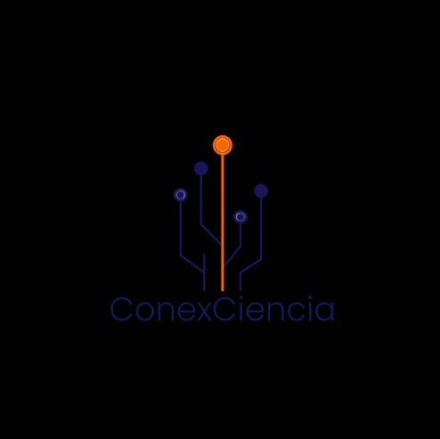

<div align="center">
  
  <h1 align="center">ConexCiencia</h1>
  <p align="center"><strong>Ciencia para niñas y niños a través de la experimentación</strong></p>
  <p align="center">
    <a href="#-descripción">Descripción</a> •
    <a href="#-secciones">Secciones</a> •
    <a href="#-tecnologías">Tecnologías</a> •
    <a href="#-estructura">Estructura</a> •
    <a href="#-instalación">Instalación</a> •
    <a href="#-fases-del-proyecto">Fases</a>
  </p>
</div>

---

## 📋 Descripción

**ConexCiencia** es un emprendimiento de divulgación científica que ofrece **talleres experimentales, shows de cumpleaños y experiencias educativas** para niñas y niños en Santiago, Chile. Este repositorio contiene su **landing page promocional**, desarrollada como proyecto académico para la asignatura de **Diseño Web**.

El sitio presenta la identidad de marca del emprendimiento e incluye información sobre el equipo, misión, servicios disponibles con precios, testimonios, preguntas frecuentes y datos de contacto.

---

## 🧩 Secciones del sitio

| # | Sección | Descripción |
|---|---------|-------------|
| 1 | **Hero** | Presentación con logo y llamados a la acción |
| 2 | **Quiénes somos** | Equipo fundador: Carolina Lagos y Gianina |
| 3 | **Misión y visión** | Propósito y meta del proyecto |
| 4 | **Shows y cumpleaños** | Dos opciones con precios, duración e imágenes |
| 5 | **Talleres para colegios** | Programa *Laboratorios del Asombro* con 8 talleres |
| 6 | **Testimonios** | Embed de publicaciones de Instagram |
| 7 | **FAQ** | Acordeón interactivo con 8 preguntas frecuentes |
| 8 | **Contacto** | Correo, teléfono, ubicación y redes sociales |

---

## 🛠️ Tecnologías

<div align="center">

| Tecnología | Uso |
|------------|-----|
| **HTML5** | Estructura semántica del sitio |
| **CSS3** | Diseño responsive con Grid y Flexbox |
| **JavaScript (Vanilla)** | Menú hamburguesa y acordeón FAQ |
| **Instagram Embed** | Testimonios dinámicos |

</div>

---

## 📁 Estructura del proyecto

```
conexciencia-migrada/
├── index.html              # Página principal (landing page)
├── README.md               # Este archivo
├── css/
│   └── estilos-v6.css      # Hojas de estilos del sitio
├── js/
│   └── main.js             # Funcionalidades interactivas
└── img/
    ├── logo.jpg            # Logo de ConexCiencia
    ├── carolina.png        # Carolina Lagos Morales
    ├── gianina.jpg         # Gianina, Bióloga Marina
    ├── espuma.jpg          # Show científico (espuma)
    ├── van-de-graaff.jpg   # Generador Van de Graaff
    ├── opcion1.jpg         # Opción 1 - Precios
    ├── opcion2.jpg         # Opción 2 - Precios
    ├── taller-grupo.jpg    # Talleres en colegios
    ├── ...                 # Otras imágenes de actividades
```

---

## 🚀 Instalación

1. Clona el repositorio:
   ```bash
   git clone https://github.com/tu-usuario/conexciencia.git
   ```
2. Abre el archivo `index.html` en tu navegador favorito.

> No requiere dependencias ni servidor — es una página 100% estática.

---

## 📦 Fases del proyecto

| Fase | Descripción | Entregable |
|------|-------------|------------|
| **Fase 1** | Maqueta HTML semántico con la estructura completa | `TA_06` |
| **Fase 2** | Aplicación de estilos CSS para identidad visual | `TA_06` |
| **Fase 3** | Migración a template + interactividad con JavaScript | `TA_07` |

---

## ✨ Funcionalidades destacadas

- ✅ **Diseño responsive** — Adaptable a móviles, tablets y escritorio
- ✅ **Navegación fija** — Menú sticky con enlaces suaves a cada sección
- ✅ **Menú hamburguesa** — Navegación colapsable en dispositivos móviles
- ✅ **Acordeón FAQ** — Preguntas frecuentes con expansión interactiva
- ✅ **Embeds de Instagram** — Testimonios en vivo desde la red social
- ✅ **Semántica accesible** — Atributos `aria-*` y etiquetas semánticas HTML5

---

## 👥 Equipo

- **Carolina Lagos Morales** — Mg. en Didáctica de las Ciencias Experimentales, divulgadora científica
- **Gianina** — Bióloga Marina, educadora y artista

---

## 📄 Licencia

Este proyecto fue desarrollado con fines académicos para la asignatura de **Diseño Web**.

---

<div align="center">
  <p>
    <a href="https://www.instagram.com/conexciencia" target="_blank">Instagram</a> •
    <a href="https://www.facebook.com/conexciencia" target="_blank">Facebook</a>
  </p>
  <sub>Hecho con ❤️ para despertar curiosidad científica</sub>
</div>
